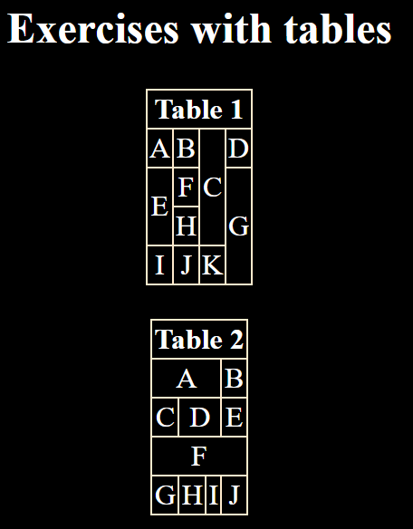

<table>
  <tr>
    <td>
        
    </td>
  </tr>
</table> 

---

  

  

---

# Front-End exercises from UTN. 👨‍💻

---

<table>
  <tr>
    <td>
      
    </td>
  </tr>
</table>

---

## Technologies used. 📌

<table class="skills">
  <tr>
    <td>
      
    </td>
    <td>
    
<h3>Html</h3>

    </td>
  </tr>

  <tr>
    <td>
      
    </td>
    <td>
    
<h3>Css</h3>

    </td>
  </tr>

  <tr>
    <td>
      
    </td>
    <td>
    
<h3>Git</h3>

    </td>
  </tr>
</table>

---

## License 📄

This project is under license [MIT License] - read the file [LICENSE.md](LICENSE) for details.

---

## Where to find me: 🌎

<table>
  <theader>
    <tr align='center'>
      <td>
        
      </td>
    </tr>
    <th>
🤴 Facu Falcone - Junior Developer
</th>
    </theader>
    <tbody>
    <tr align='center'>
      <td>
        
      </td>
    </tr>
    <tr align='center'>
      <td>
        
      </td>
    </tr>
    <tr align='center'>
      <td>
        
      </td>
    </tr>
    <tr align='center'>
      <td>
        
      </td>
    </tr>
  </tbody>
</table>
